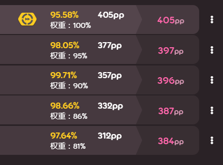

# 排名（PP）

## 非官方的排名系统一览 - osu!skills, pp+和cost 

### 1.简介 

#### 1.1 写在之前 

* 本文的大部分内容都是对相对应排名系统网站上内容的翻译。
* 1.2和1.3中的内容几乎都是编写者自己对于现存排名系统的**主观认识和理解**，还请各位在阅读当中辩证思考，理性讨论。

#### 1.2 现有的pp排名系统（ppv2） 

从一开始的Score系统到ppv1再到ppv2，osu!的排名系统经历的几次大的改动。本段将着重于介绍现在的排名系统：**ppv2**。

ppv2通过计算每一张图的不同分项的难度（大致可以分为aim、flow和acc）来给出一个特定的pp数值。当玩家成功达到了某特定pp数值的标准，那么玩家就会从该图中得到相应的pp。同时，ppv2系统引入了**权重**，即：玩家打一张图获得的pp越高，则此pp数值的权重就越高。

这里以某玩家的主页最好成绩为例，可以看到：第二个最好成绩的权重是**95%**，也就是说，虽然pp系统给出的数值为**397pp**，但由于权重的限制，这个成绩最终将会被计算成为**377pp**。

当然，ppv2也存在着不小的缺陷：在一般情况下，锐角移动的难度权重会远远高于钝角移动或是高速图的权重；滑条仅被当作一个单独的打击圈来进行计算。也就是说，玩家fc了有一些比同星数等级的“跳图”还更加要求全面能力的tech或高速图，但是往往得不到和前者相等甚至更多的pp；同时，一张图的SR也大受影响。虽然开发组在2018年下旬对此进行了一系列完善和更改，但却总是有新的更大的问题出现，也满足不了一些玩家的需求。

对此，一些玩家提出了自己的非官方排名和系统。这些系统旨在将一个玩家的不同打图技术进行细分，并对每一个都给予单独的pp数值，从而能够达到对于一个玩家有**较为完整且客观的评价与排名。**

本文将具体介绍两个较为有名的非官方排名系统：**osu!skills**和**PerformancePlus+**（简称pp+）

#### 1.3 非官方排名系统：对比 

非官方排名系统的一大特点如上所述，就是将一个玩家的**总体实力拆分成几个小区域**进行分别排名，最后得出另外一个pp数值；另外也有将玩家的各项实力数值化，并附以国内和全球排名，以求玩家对自己的水平有一个更加直观的了解。一些系统已经在一些国内外举办的比赛中进行使用，以用来进行更好的分组/限制玩家。

当然，没有一个系统能够做到真正客观和完美。即便是玩家开发的非官方排名系统也会遇到诸多对玩家进行评价和排名时的问题，在此就不多赘述。从实际来讲，每个系统都做不到在每个实力项中进行权重的平均分配；**但非官方系统的做法至少让每个玩家的各项实力在一部分上可视化，从而能让玩家在一般情况下对于自己或他人的实力有更加客观的了解。**

### 2. osu!skills 

#### 2.1介绍 

**2.1.1 官方介绍**

* osu!skills是一个非官方的评级和排名网站，评价标准以打图时实际会用到的实力分项为准。该系统旨在用独立的Skill Points来对一个玩家的实力分项进行数值化，并使他的强处/弱处可视化。 该系统有着自己的全球和国家排名，玩家还可以通过页面上Tools选项栏下方的Versus选项将自己和另外一个玩家进行横向对比。
* osu!skills使用如下8个实力分项来对玩家进行评价：
  * **Stamina** — 击打耐力
  * **Tenacity** — 韧性，一般指与打串的有关技巧
  * **Agility** — 锐角移动，大跳能力
  * **Precision** — 击打精准度，特指对于小CS的精准度
  * **Reaction** — 直读能力，可以看作对于AR的反应能力
  * **Reading** — 一般的读图能力
  * **Memory** — 记忆背图能力
  * **Accuracy** – 击打精准度，特指对于音乐节奏上的控制击打能力

**2.1.2 训练分区（Traning）**

* 玩家可以在主页Tools选项栏下方找到Traning分区；此分区可以看作是一个根据你自己要求的自动抓图器，在页面中会给出上述8个实力分项的训练强度调整条，玩家可以根据自己的实力进行调整，网站会给出一系列根据玩家要求而自动抓取的铺面推荐。在页面的下方，玩家可以自己选择想要用什么样的mod进行练习，或者取消掉一个或多个mod。另外，网站还提供了10个预设情况，玩家可以根据预设给出的不同情景进行快速抓取。
* **注意！**由于谱面推荐是自动抓取的，在一定情况下可能会出现完全不适合该玩家自身水平的图，请玩家自己进行筛选和对比，从而达到更好的练习效果。

**2.1.3 网址**

### 3. PerformancePlus+\(pp+\) 

#### 3.1介绍 

**3.1.1官网介绍**

* pp+于2017年4月13日上线，是一个非官方的评级和排名网站，旨在能够更加清楚的体现玩家的真正实力。该网站对于其分出的8个实力分项同样有着自己的全球/本国排名、更加细化的玩家主页信息和对于任何一个已rank图的，根据pp+进行排名的排行榜。
* pp+将一个玩家的实力技巧分为八个小项，每一个小项都有自己的pp值，可以更加方便的进行玩家之间的横向对比。
* 实力分项如下：
  * **Total Performance —总pp值** 此项在原则上是和官方的pp总值相同的。**对于一张图**来说，该图的pp值即是“移动”、“节奏击打准确度”给出的pp值和“整体手速能力”与“耐力”两项中较高一项的值的总和；**对于玩家**来说，总pp值即是玩家所有成绩加总并权重后的一半，再加上玩家的“移动”、“节奏击打准确度”和“整体手速能力”或“耐力”（两者取一高）的评价值的一半。
  * **Aim\(Total\) — 综合移动能力** 此项在原则上仍然和官方的算法相同。此项被分为三个小项：锐角移动能力、间距连打能力和击打小圈精准度。前两项是互补的，但算法在计算综合移动能力的时候并不会直接将这两项进行加总；这两项只会单纯计算一张图中的锐角移动/间距连打排列。小圈精确度只单纯计算CS带来的pp值变化。
  * **Aim\(Jump\) — 锐角移动能力** 如上所述，该项只单纯计算一张图中的锐角移动部分的难度。除了官方算法的纯间距以外，该分项还会计 算大跳角度和锐角跳中的基本排列。
  * **Aim\(Flow\) — 间距连打能力** 该项主要计算一张图中的**钝角移动部分**的难度，而这个难度的一大部分来源于应对连打时的移动能力。除了官方算法中的纯间距以外，该项还会计算各式的连打接跳、锐角弯和一般的钝角移动的总体难度。在之前，算法会将大间距连打看作低/无间距单戳，从而给出额外的Speed奖励，而不是综合Aim上的奖励；但是现在的算法将低/无间距单戳和大间距连打分开进行计算，也就是：**大间距会有Aim上的奖励。**
  * **Aim\(Precision\) — 小圈精确度** 顾名思义，该项只单纯计算CS带来的pp值变化，并以CS1进行参考。
  * **Speed & Stamina — 整体手速&高bpm/长串稳定度** Speed分项的计算和官方虽然有相似，但它被分为两类，以来分别衡量Speed中两个虽然有对比，但又高度交织的方面。Speed 只衡量一张图对于手速的硬性要求，而Stamina衡量的则是打一张图所需要的耐力或稳定性。一般来讲，bpm越高，这两项的值就会越高，但是一张高bpm爆发图的Speed值就会明显比Stamina要高，而对于一张死亡连打图来说则是正好相反。
  * **Accuracy — 节奏准确度** 这个分项相比于官方的算法被进行了大改。不同图的OD直接被标准化成为一个单独的**“Super-OD”**，而具体的衡量则是相对于这个单独的OD进行，同时算法也会将一张图的物件数进行计算。一张图的整体节奏复杂性也被算入其中，并在最后作为乘数投入到最终的准确度计算中，例如**二连、四连等复数切指/串与三分拍或六分拍**这样的复杂节奏。
  * **Reading? — 读图能力？** 虽然该分项并没有被单独分离出来，但是它作为“同屏物件密度”的形式成为了给Aim分项的一个奖励，这个奖励在HD的情况下尤其多，因为HD代表的即是更高的同屏物件密度。

**3.1.2 网址**

#### 3.2 osu!chan — 一个更加可视化的玩家主页 

**3.2.1简介**

* osu!chan是pp+的开发者的另外一个项目。该网页将玩家的主页数据变得更加可视化，还加入了许多统计数据，让玩家了解到 ****~~**自己那个1miss的玩意其实值一堆pp**~~ ****自己的长处和不同的mod的数据。例如：玩家可以知道自己从哪个麻婆那里拿到了最多的pp，查看自己最擅长哪个mod，AR，歌曲长度或者自己的bp密度等等。该网站支持全部4个游戏模式。

**3.2.2 网址**

### 4.非官方排名评价系统的实际运用 — cost系统 

#### 4.1 简介 

* 玩家对于这两个非官方排名系统的反应是非常正面的。本段将着重介绍**国内主要比赛**中利用pp+从而做出的全新的比赛限制：cost系统。
* 国内主要的比赛/联赛，例如OCL系列、MP4、 ~~某个不能提起名字的比赛~~ 毒品杯（详见Tournament分项），都广泛使用了cost系统。此系统旨在利用特定算法对玩家的pp+各项数值进行计算，最终得出一个数值，并用其来对玩家**组队、报名、上场机会等进行限制**。与只用官方算法pp进行限制的情况不同，由于pp+在一定方面上能够更加真实反映一个玩家的实力，cost系统对于玩家的限制也就在一般情况下更加准确。另外，不同级别的比赛都会有一套不同的算法，以保证对于不同水平或者拥有不同实力技能的玩家都能照顾到 ****~~**（实际上是被坑爆）**~~
* 在cost系统中的实力分项为：**锐角移动能力、间距连打能力、小圈精确度 、点击精确度、整体手速能力和长串稳定能力**。这六项在cost算法中并无本质上的轻重之分，不过原则上来讲，**Speed/Stamina/Accuracy**这三项的占比会稍高一些。
* 目前非官方的排名系统在国外的比赛中很少被运用，偶尔会有比赛在组队的时候对一个队伍的pp+总和或平均值进行排名，以便分组，但是这种情况也很少见。

#### 4.2 查询方法 

* 找到白菜机器人（由Mother Ship开发，在各大osu!群中基本都可以找到），在私聊窗口键入”!costme”命令，机器人就会发过来一张pp+数据六维图，并在下面标注你的pp+换算成各个比赛的cost会有多少（有时候也会告诉你网络弱智而加载不出来）。
* **注意：cost几乎无法倒刷！当你下定决心要参加一个运用cost系统的比赛时，请一定要看好你的cost，如果一不小心用力过猛，可能这届比赛就和你说再见了！当然，低cost不一定意味着你就一定要坐板凳，比赛的意义本身就是为你提供一个更广阔的自我提升的平台，还请你理性看待这个系统！**

### 5. 写在后面 

首先，谢谢你读到最后。

这个文档其实我在两年前就写过，当时主要是想为新人群的人扫盲，但是很可惜，原来的文档已经找不到了，于是这次就索性重新好好写了一次。和当时的自己相比，现在的我对于pp的认识有没有更全面和理性一点呢（笑）

要感谢爆炸哥，可以给我这样宝贵的机会；也要感谢他和其他wiki组的成员，能够拿出时间为广大玩家做出如此大的贡献，相信这个wiki之后也会成为许多玩家分享自己心得和理性交流的好地方。

最后，写给正在看这个文档的你：看到这里，想必你已经对于整个系统有了更深刻的了解。如同前面所说，pp+在衡量你的实力的时候会更加全面，这也就导致你在pp+上的pp值会比官方系统的高一些。你需要理解的是，**数字永远只能是数字**，真正的实力只能在比赛场上那决定性的一瞬间中闪耀。在你今后的路上，相信你会看到很多用pp+来进行比较甚至是攀比的场景，还希望你能够想起这些话，理性对待它，让它成为你的垫脚石，而不是阻止你进步的绊脚石。希望这篇文档能够帮到你。

_**Enjoy the game!**_

